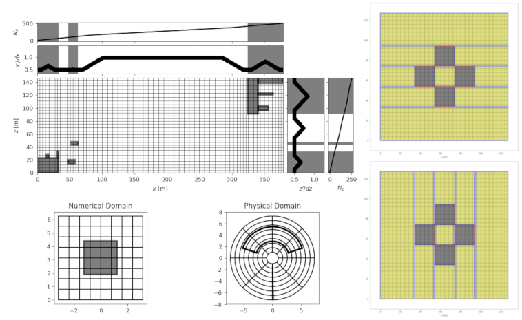

==================
Introducing fdgrid
==================

.. image:: https://badge.fury.io/py/fdgrid.svg
    :target: https://badge.fury.io/py/fdgrid.svg

Presentation
============

**fdgrid** provides some tools to create **regular**, **adaptative** or
**curvilinear** 2D grids. **fdgrid** has been designed to work with nsfds2 but can also be used alone. **fdgrid** provides tool to:

* Generate 2D meshes : x and z coordinates
* Subdivide the grid into Subdomain objects used by nsfds2

**fdgrid** provides 3 main types of objects to create meshes:

* `Mesh`: Create a regular mesh

* `AdaptativeMesh`: Create a mesh that is adapted around obstacles and close to the boundaries

* `CurvilinearMesh`: Create a mesh using curvilinear coordinates

**fdgrid** provides three main objects to create computation domains and/or sets of obstacles:

* `Domain` : Container for `Subdomain` objects

* `Subdomain` : Subdivision of the grid

* `Obstacle` : Subdomain subclass with moving boundary possibilities

Some geometry templates can be found in the `template` module. Examples are gathered in the following and in `docs`.

Requirements
============

:python: > 3.7
:matplotlib: > 3.0
:numpy: > 1.1
:scipy: > 1.1
:ofdlib2: > 0.8

Installation
============

Clone the repo and :
::

    python setup.py install

or install via Pypi :
::

    pip install fdgrid
