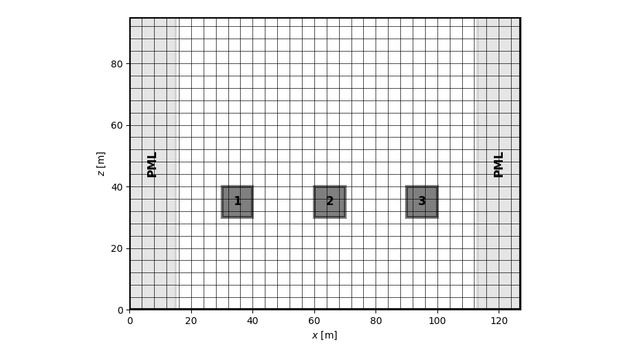
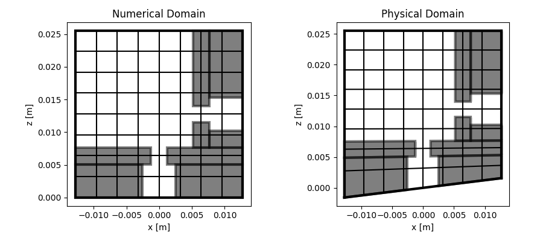
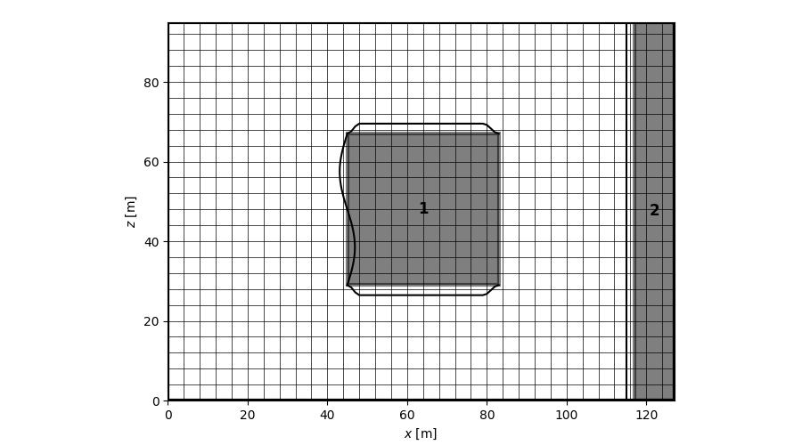

==========
Quickstart
==========

Construction rules
==================

* **Boundary conditions (bc)** -- Rules raising `BoundaryConditionError`
  exception if not respected:

    * **bc** of the domain must be a combination of **'ZRAPW'** as for
      (**Z**)impedance, (**W**)all, (**A**)bsorbing, (**R**)adiation, and (**P**)eriodic
    * **bc** of each `Obstacle` object must be a combination of
      (**Z**)impedance, (**W**)all, (V) velocity
    * If periodic (**P**) is chosen as boundary condition for an edge of the
      domain, '**P**' must also be chosen as boundary condition for the edge
      facing it

* **Grid construction** -- Rules raising `GridError` exception if not respected:

    * The number of points of the **PML** must be larger than this of the
      stencil, otherwise `GridError` exception will be raised
    * Origin of the domain must be in the domain
    * For curvilinear meshes, geometric conservation laws must be verified
      (variable change must remains soft)

* **Obstacle location** -- Rules raising `CloseObstacleError` exception if not respected

    * Two obstacles cannot be close to a distance of less than twice the size of
      the stencil that has been declared (11 by default) **except** if they
      have a common edge
    * An obstacle cannot sit astride an (**A**)borbing subdomain and a
      regular subdomain
    * If an obstacle is located inside an (**A**)bsorbing subdomain (whose
      width is defined by `Npml`), an edge of this obstacle must
      correspond to the edge of the domain.

Creation of set of obstacles
============================

`Domain` and `Obstacle` objects can be used to create sets of obstacles.

* Use `Obstacle` to create an obstacle:

    * First argument is a list of coordinates as *[left, bottom, right, top]*
    * Second argument is the boundary conditions [*(W)all, (V) velocity,
      (Z)impedance*]

* Use `Domain` to gather all `Obstacle` objects:

    * First argument is the shape of the grid (*tuple*)
    * Keyword argument `data` is a list of `Obstacle` objects

For instance:
::

    from fdgrid import Mesh, Obstacle, Domain

    def custom_obstacles(nx, nz):

        geo = [Obstacle([30, 20, 40, 40], 'WWWW'),
               Obstacle([60, 20, 70, 40], 'WWWW'),
               Obstacle([90, 20, 100, 40], 'WWWW')]

        return Domain((nx, nz), data=geo)

    nx, nz = 128, 64
    dx, dz = 1., 1.
    ix0, iz0 = 0, 0
    bc = 'AWAW'

    mesh = Mesh((nx, nz), (dx, dz), (ix0, iz0), obstacles=custom_obstacles(nx, nz), bc=bc)
    mesh.plot_grid(pml=True)

Adaptative mesh example
=======================
::

    from fdgrid import AdaptativeMesh, templates

    shape = (512, 256)	# Dimensions of the grid
    steps = (1, 1)		# grid steps
    ix0, iz0 = 0, 0		# grid origin
    bc = 'WWWW' 		# Boundary conditions : left, bottom, right, top.
                                # Can be (W)all, (A)bsorbing, (P)eriodic, (Z)impedance, (R)adiation

    # Set up obstacles in the grid with a template
    obstacles = templates.testcase1(*shape)

    # Generate AdaptativeMesh object
    msh = AdaptativeMesh(shape, steps, (ix0, iz0), obstacles=obstacles, bc=bc)

    # Show
    msh.plot_grid(axis=True, N=8)

.. image :: images/adaptative.png

Curvilinear mesh example
========================
::

    from fdgrid import CurvilinearMesh, templates
    import numpy as np

    shape = (256, 256)       # Dimensions of the grid
    steps = (1e-4, 1e-4)     # grid steps
    origin = (128, 0)        # grid origin
    bc = 'WWWW'              # Boundary conditions : left, bottom, right, top.
                             # Can be (W)all, (A)bsorbing, (P)eriodic, (Z)impedance, (R)adiation

    # Set up obstacles in the grid with a template
    obstacles = templates.helmholtz_double(nx, nz)

    # Setup curvilinear transformation
    def curv(xn, zn):
        f = 5*dx
        xp = xn.copy()
        zp = zn + np.exp(-np.linspace(0, 10, zn.shape[1]))*np.sin(2*np.pi*f*xn/xn.max()/2)
        return xp, zp

    # Generate CurvilinearMesh object
    msh = CurvilinearMesh(shape, steps, origin, obstacles=obstacles, bc=bc, fcurvxz=curv)

    # Show physical grid
    msh.plot_physical()

Mesh with moving boundaries
===========================

`Obstacle` instances inherit the `set_moving_bc` method. This method allows you
to set moving edges. `set_moving_bc` can take as many arguments as the number
of **V** boundaries. Each of these arguments must be a dictionary
with the following keys :

* `f`: the oscillation frequency
* `A`: the oscillation amplitude
* `phi`: the phase of oscillation
* `func`: the oscillation profile of the boundary. For now, it can be 'sine' (sine
  profile), 'tukey' (tapered cosine profile), or 'flat' (constant profile)
* `kwargs`: special arguments than can be passed to `func`

An example is given below:
::

    from fdgrid import Mesh, Obstacle, Domain

    def custom_obstacles(nx, nz, size_percent=20):

        size = int(min(nx, nz)*size_percent/100)

        obs1 = Obstacle([int(nx/2)-size, int(nz/2)-size, int(nx/2)+size, int(nz/2)+size], 'VVWV')
        obs2 = Obstacle([nx-11, 0, nx-1, nz-1], 'VWWW')

        obs1.set_moving_bc({'f': 70000, 'A': 1, 'func': 'sine'},
                           {'f': 30000, 'A': -1, 'func': 'tukey'},
                           {'f': 30000, 'A': 1, 'func': 'tukey'})
        obs2.set_moving_bc({'f': 73000, 'A': -1, 'func': 'flat'})

        return Domain((nx, nz), data=[obs1, obs2])

    nx, nz = 128, 96
    dx, dz = 1., 1.
    ix0, iz0 = 0, 0
    bc = 'WWWW'

    mesh = Mesh((nx, nz), (dx, dz), (ix0, iz0), obstacles=custom_obstacles(nx, nz), bc=bc)
    mesh.plot_grid(pml=True, legend=True, bc_profiles=True)

